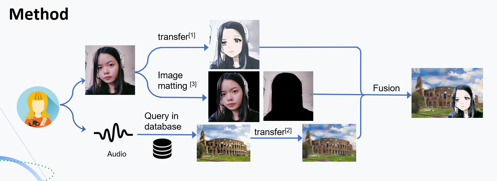
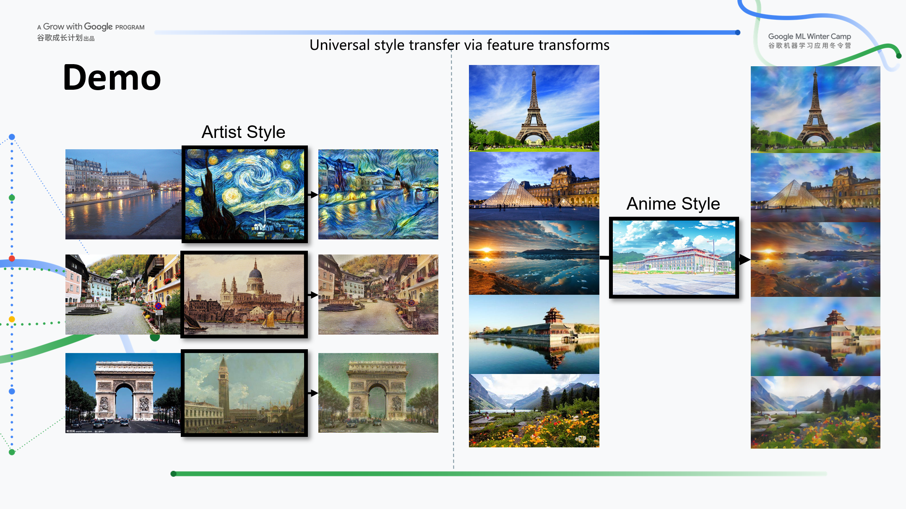
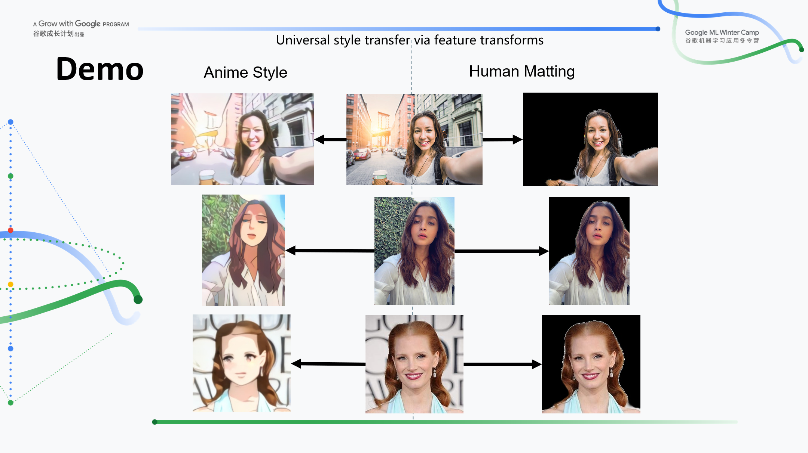
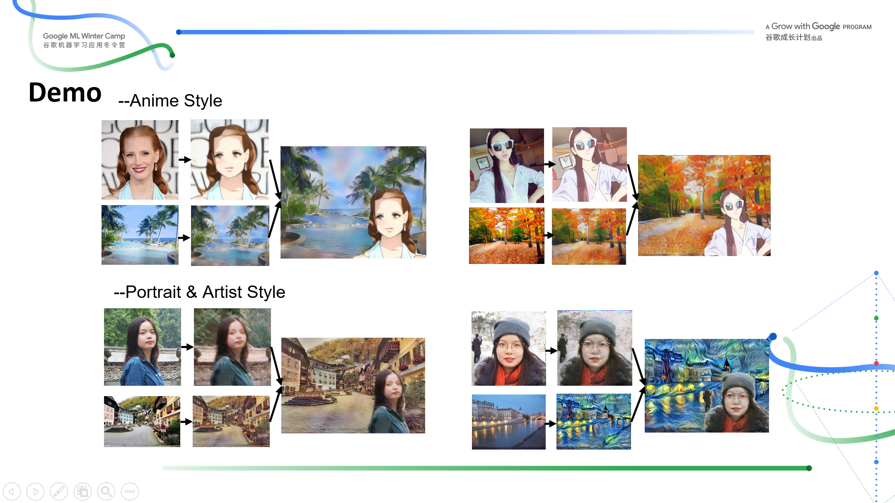
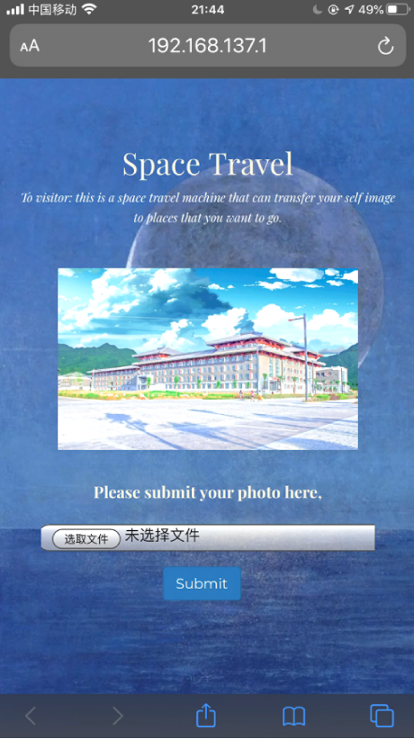
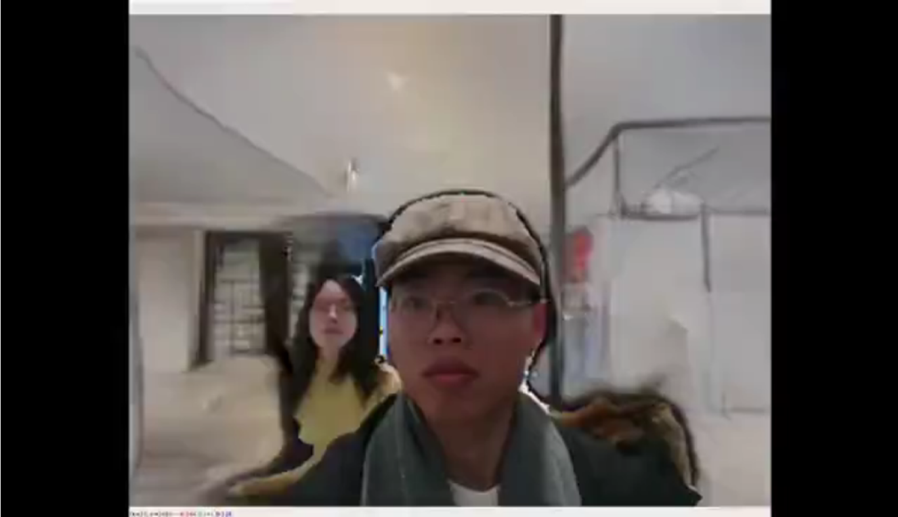

# hyperplane-google-winter-camp

## Space Travel

- There are times that you want to travel to some specific scenic spots but is drawn back by the long distance and high expense. 
- You may also want to know what your self image looks like in anime style.
- Then this Space Travel program can help realize your dream! All you need to do is updating a selfie and choosing the specific place you want to go.

## Instructions
This repo contains three deep models, which do the human face transfer, background transfer and image matting respectively.

Please run the `app.py` in the `web_server` folder to start the program, and try the demo by visiting: http://localhost:8181

All dependency is contained in the `requirements.yml` file. Just enjoy it !!!

## Demos

Here are some demo images and demo videos.

---

- Background Style Transfer (Artist Style and Anime Style is shown below.)

---
- Human Matting and Face Style Translation

---
- Foreground and Background Fusion and Final Result. 

---

- Html5 Demo &  Real Time Human Matting and Background Style Transfer in Video Data.

(Click the pictures below to view the demo video)

<table align='center'>
<tr align='center'>
<td> Html5 Demo </td>
<td> Real Time Matting and Background Transfer</td>
</tr>
<tr>
<td>
<td>

</tr>
</table>

 
## Reference

[1] Kim J, Kim M, Kang H, et al. U-GAT-IT

[2] Li Y, Fang C, Yang J, et al. Universal style transfer via feature transforms

[3] Zhu, Bingke et al. “Fast Deep Matting for Portrait Animation on Mobile Phone.” 

[4] https://github.com/taki0112/UGATIT

[5] https://github.com/Yijunmaverick/UniversalStyleTransfer

[6] https://github.com/ofirlevy/FastMattingPortrait

